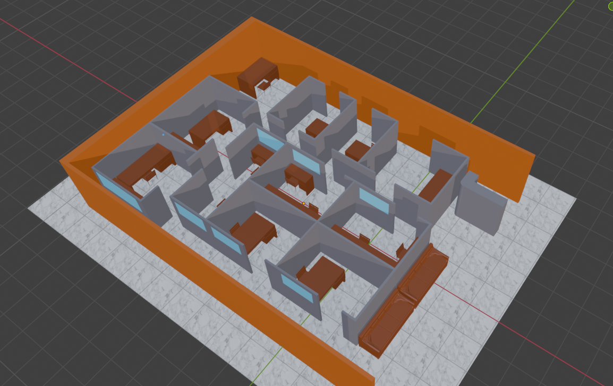
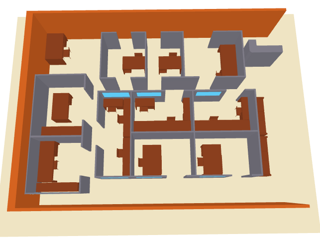
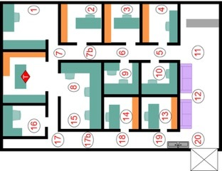
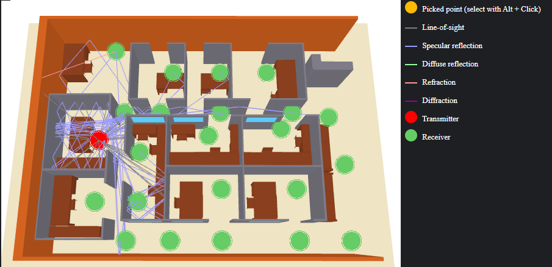
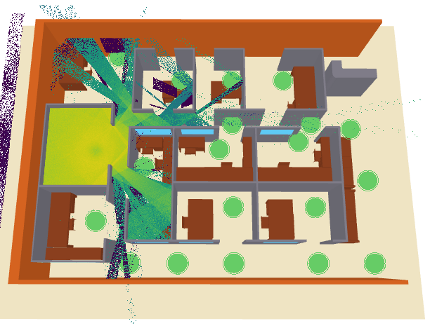
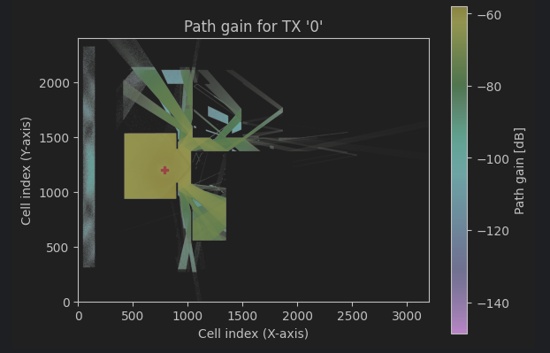
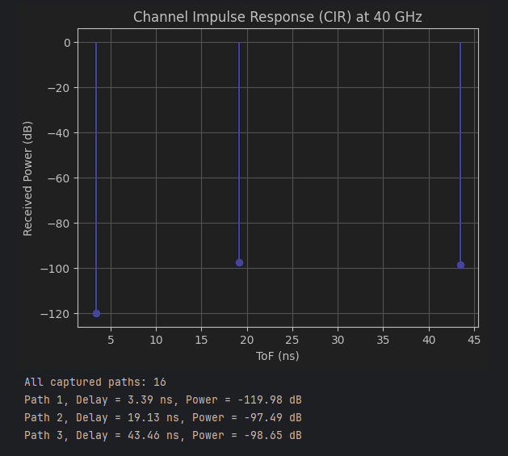

# Avances 1.5

Terminé la primera versión del escenario a utilizar, esta versión no es la definitiva
debido a que falta su revisión y los cambios pertinentes. Esta versión cuenta con todos 
los cubículos, ventanas, escritorios y sillas. Por lo que la asignación de materiales fue 
así (acorde al simulador):

- Paredes de los cubículos: **metal**
- Paredes del edificio: **ladrillo**
- Escritorios y sillas: **madera**
- Ventanas: **vidrio**
- Piso: **mármol**

## Imagen del escenario en blender


También anexo el archivo blender en el repositorio

## Resultados hasta el momento
No sé si pudieron correr el jupyter notebook, asi que les dejo capturas de los resultados

- Vista del escenario en el simulador


- Configuración de las antenas
````
scene.tx_array = PlanarArray(
    num_rows=1,
    num_cols=1,
    vertical_spacing=0.5,
    horizontal_spacing=0.5,
    pattern="dipole",
    polarization="V")

scene.rx_array = PlanarArray(
    num_rows=1,
    num_cols=1,
    vertical_spacing=0.5,
    horizontal_spacing=0.5,
    pattern="dipole",
    polarization="V")
````
- La posición del transmisor y los 22 receptores se basó en la siguiente imagen


- Simulacion de los rayos

Se configuró como que el rayo solo puede rebotar hasta 4 veces y simula 1,000,000 de 
rayos posibles 


Mapas de radiación



Channel Impulse Response


## Solución a problemas (Si es que alguien va a leer la documentación en un futuro)

Cuando se modela en Blender, suele pasar que se dejan puntos perdidos o algunas estructuras están 
huecas, esto crea problemas a la hora de exportar el modelo a .XML, es por eso que se añade los pasos
para limpiar el escenario, arreglar geometrías defectuosas y asegurar que las normales de los objetos 
sean correctas.

 ### 1. Selecciona todo en Modo Objeto:

Ve a la ventana principal (Object Mode).

Presiona la tecla A para seleccionar absolutamente todos los objetos de tu cuarto.

### 2. Aplica las transformaciones a todo:

Presiona Ctrl + A y selecciona "All Transforms".

### 3. Entra al Modo Edición con todo seleccionado:

Presiona Tab. Como seleccionaste todo previamente, entrarás al Modo Edición viendo la malla de toda tu habitación al mismo tiempo.

Presiona A de nuevo para asegurarte de que todos los vértices del cuarto estén iluminados en naranja.

### 4. Ejecuta la limpieza masiva:

Limpiar duplicados: Presiona M -> y selecciona "By Distance". (Verás un mensaje abajo diciendo cuántos vértices basura se eliminaron en total).

Arreglar las Normales: Presiona Shift + N (Esto obliga a todas las flechas físicas de tu cuarto a apuntar hacia la dirección correcta).

Triangular: Presiona Ctrl + T para convertir todos los polígonos del cuarto en triángulos perfectos.

### 5. Guarda y Exporta:

Presiona Tab para volver al Modo Objeto.

Haz clic en un espacio vacío para deseleccionar.


## License and Citation

Sionna is Apache-2.0 licensed, as found in the [LICENSE](https://github.com/nvlabs/sionna/blob/main/LICENSE) file.

If you use this software, please cite it as:
```bibtex
@software{sionna,
 title = {Sionna},
 author = {Hoydis, Jakob and Cammerer, Sebastian and {Ait Aoudia}, Fayçal and Nimier-David, Merlin and Maggi, Lorenzo and Marcus, Guillermo and Vem, Avinash and Keller, Alexander},
 note = {https://nvlabs.github.io/sionna/},
 year = {2022},
 version = {2.0.1}
}
```
