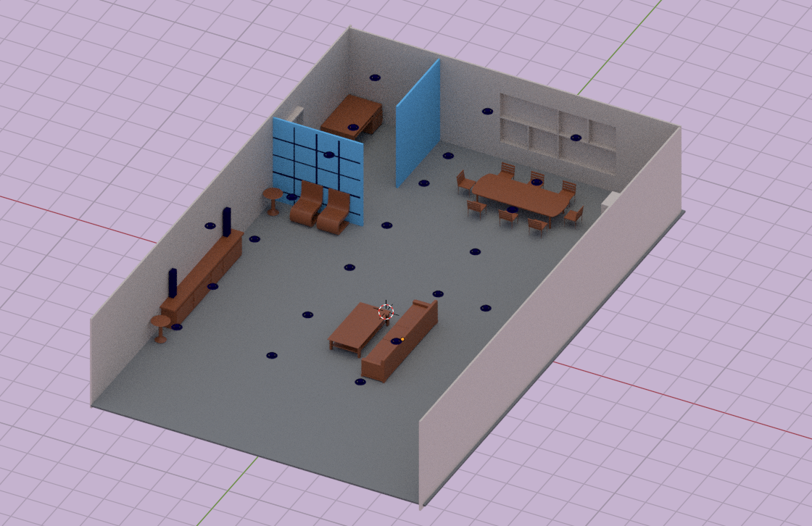
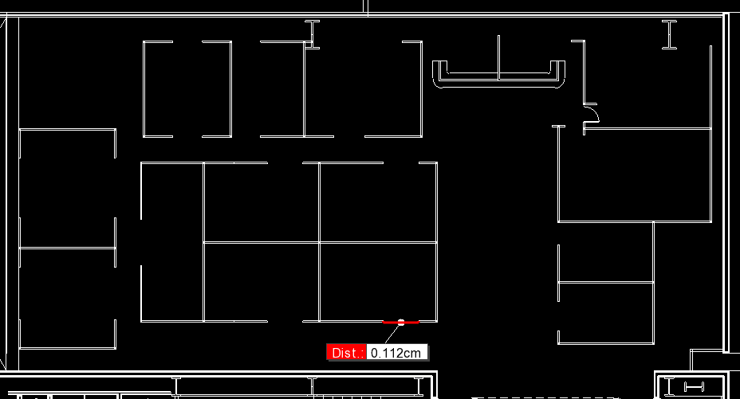
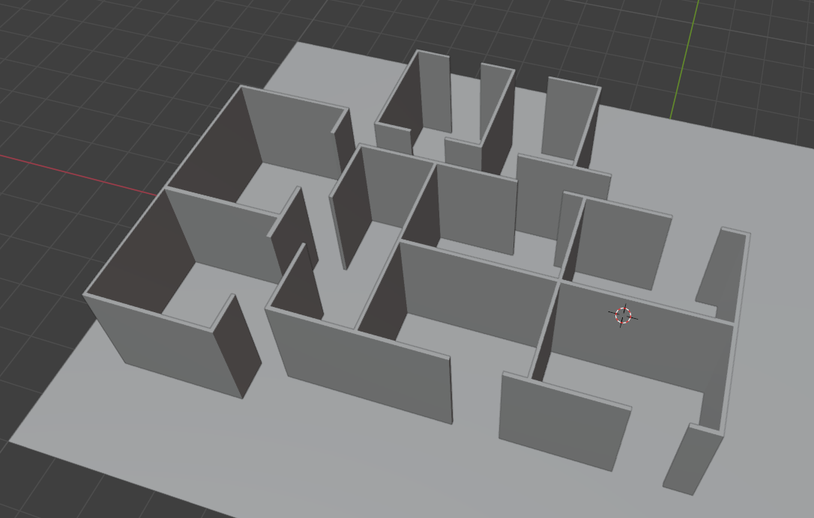

# Avances hasta el momento

Descargué y adapté un modelo 3D de una habitación en Blender, esta habitación es 
de 4 paredes, 1 piso, 1 techo y 1 un pequeño espacio recubierto por paredes de 
vidrio. A partir de este modelo generé una simulación de ray-tracing, la cual 
pueden ver en el jupyter notebook llamado: 
[Tests](PythonProject/Tests.ipynb)

### Escenario en blender


La documentación oficial y tutoriales se encuentran 
[aquí](https://nvlabs.github.io/sionna/).

Consideraciones relacionadas al uso de Blender y la base del simulador (Mitusba):

- Versiones compatibles: 
Las versión de Blender compatible es (y la que se usó) 4.2, junto con el .zip 
disponible del add-on para exportar a .XML está
[aquí](https://github.com/mitsuba-renderer/mitsuba-blender)
- Requerimientos del simulador:
El simulador requiere que TODOS los objetos del escenario tengan un material asignado,
por lo que si se piensa incluir muchos objetos hay que tomarlo en cuenta, la lista de
materiales que admite el simulador está [aquí](https://nvlabs.github.io/sionna/rt/api/radio_materials.html#)
- Forma de asignar materiales:
La forma más sencilla y directa es asignar el material en Blender
- Colores en simulación:
Un error que puede suceder es que al cargar el escenario la mayoría esté de color rosa,
esto es debido a que Mitsuba no soporta muchas de las superficies de Blender, por lo
que lo ideal es dejar las superficies como: BSDF y asignarles un color único para su 
diferenciación 

### Datos faltantes y necesarios para continuar con el modelado del escenario final

Los datos que faltan son:
- #### Medidas exactas del plano
Las medidas dentro del .dwg son confusas, prueba de ello es al abrir el visor e-drawings
que trabaja de la misma manera que el de AutoCAD

Una aproximación es tomar el valor de la captura como que en realidad es 1.12 m 
(Considerar que eso es una puerta)

- #### Arreglo real de las habitaciones
Otro apartado confuso es cómo realmente están cerrados los cubículos (eso creo que son)
ya que cómo se ve en la parte central superior hay 2 paredes chocando, además que no todos 
los cubículos están 100 % cerrados, por lo que pido asistencia para estas consideraciones.

- #### Materiales de los objetos (Los que se puedan usar acorde con la lista previa)
- Esto también es muy relevante ya que SIN MATERIAL NO SE PUEDE SIMULAR el objeto, esto
lo dejo a su consideración.

## Avance del escenario final

Aún con las consideraciones faltantes mencionadas, realicé un modelo en Blender de cómo
se podría ver el escenario final SIN CONSIDERACIONES



## Setup
Yo utilicé el IDE PyCharm porque me resultó más cómodo
Si se usa PyCharm solo se necesita correr este comando en la terminal:
```
 pip install -r "requirements.txt"
```

## License and Citation

Sionna is Apache-2.0 licensed, as found in the [LICENSE](https://github.com/nvlabs/sionna/blob/main/LICENSE) file.

If you use this software, please cite it as:
```bibtex
@software{sionna,
 title = {Sionna},
 author = {Hoydis, Jakob and Cammerer, Sebastian and {Ait Aoudia}, Fayçal and Nimier-David, Merlin and Maggi, Lorenzo and Marcus, Guillermo and Vem, Avinash and Keller, Alexander},
 note = {https://nvlabs.github.io/sionna/},
 year = {2022},
 version = {2.0.1}
}
```
